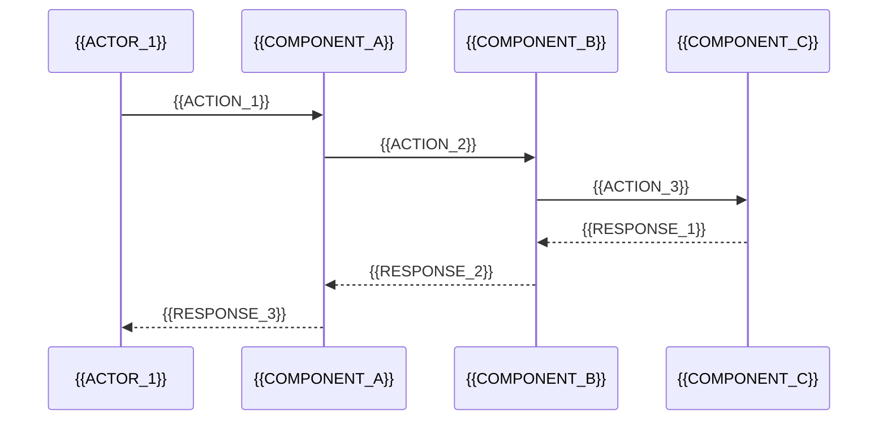

# {{PROJECT_NAME}} - Architecture Documentation

> Last Updated: {{LAST_UPDATED}}
> Version: {{VERSION}}
> Iteration: {{CURRENT_ITERATION}}

## System Overview

{{SYSTEM_OVERVIEW_DESCRIPTION}}

### High-Level Architecture

```mermaid
graph TB
    subgraph "{{LAYER_1_NAME}}"
        A[{{COMPONENT_A}}]
        B[{{COMPONENT_B}}]
    end

    subgraph "{{LAYER_2_NAME}}"
        C[{{COMPONENT_C}}]
        D[{{COMPONENT_D}}]
    end

    subgraph "{{LAYER_3_NAME}}"
        E[{{COMPONENT_E}}]
        F[{{COMPONENT_F}}]
    end

    A --> C
    B --> C
    C --> D
    D --> E
    D --> F
```

### Architecture Principles

1. **{{PRINCIPLE_1}}**: {{PRINCIPLE_1_DESC}}
2. **{{PRINCIPLE_2}}**: {{PRINCIPLE_2_DESC}}
3. **{{PRINCIPLE_3}}**: {{PRINCIPLE_3_DESC}}

## Components

### {{COMPONENT_1_NAME}}

**Purpose:** {{COMPONENT_1_PURPOSE}}

**Responsibilities:**
- {{RESPONSIBILITY_1}}
- {{RESPONSIBILITY_2}}

**Interface:**
```{{LANGUAGE}}
{{COMPONENT_1_INTERFACE}}
```

**Dependencies:**
- {{DEPENDENCY_1}}
- {{DEPENDENCY_2}}

---

### {{COMPONENT_2_NAME}}

**Purpose:** {{COMPONENT_2_PURPOSE}}

**Responsibilities:**
- {{RESPONSIBILITY_1}}
- {{RESPONSIBILITY_2}}

**Interface:**
```{{LANGUAGE}}
{{COMPONENT_2_INTERFACE}}
```

**Dependencies:**
- {{DEPENDENCY_1}}
- {{DEPENDENCY_2}}

---

<!-- Add more components as needed -->

## Data Flow

### Primary Data Flow



### Data Models

#### {{MODEL_1_NAME}}

| Field | Type | Description |
|-------|------|-------------|
| {{FIELD_1}} | {{TYPE_1}} | {{FIELD_1_DESC}} |
| {{FIELD_2}} | {{TYPE_2}} | {{FIELD_2_DESC}} |

#### {{MODEL_2_NAME}}

| Field | Type | Description |
|-------|------|-------------|
| {{FIELD_1}} | {{TYPE_1}} | {{FIELD_1_DESC}} |
| {{FIELD_2}} | {{TYPE_2}} | {{FIELD_2_DESC}} |

### State Management

{{STATE_MANAGEMENT_APPROACH}}

```mermaid
stateDiagram-v2
    [*] --> {{STATE_1}}
    {{STATE_1}} --> {{STATE_2}}: {{TRANSITION_1}}
    {{STATE_2}} --> {{STATE_3}}: {{TRANSITION_2}}
    {{STATE_3}} --> [*]: {{TRANSITION_3}}
```

## Technology Decisions

### Decision Log

#### {{DECISION_1_TITLE}}

| Aspect | Details |
|--------|---------|
| **Date** | {{DECISION_1_DATE}} |
| **Status** | {{DECISION_1_STATUS}} |
| **Context** | {{DECISION_1_CONTEXT}} |
| **Decision** | {{DECISION_1_DECISION}} |
| **Rationale** | {{DECISION_1_RATIONALE}} |
| **Alternatives** | {{DECISION_1_ALTERNATIVES}} |
| **Consequences** | {{DECISION_1_CONSEQUENCES}} |

---

#### {{DECISION_2_TITLE}}

| Aspect | Details |
|--------|---------|
| **Date** | {{DECISION_2_DATE}} |
| **Status** | {{DECISION_2_STATUS}} |
| **Context** | {{DECISION_2_CONTEXT}} |
| **Decision** | {{DECISION_2_DECISION}} |
| **Rationale** | {{DECISION_2_RATIONALE}} |
| **Alternatives** | {{DECISION_2_ALTERNATIVES}} |
| **Consequences** | {{DECISION_2_CONSEQUENCES}} |

---

### Technology Stack

| Category | Technology | Version | Purpose |
|----------|------------|---------|---------|
| Language | {{LANG}} | {{LANG_VERSION}} | {{LANG_PURPOSE}} |
| Framework | {{FRAMEWORK}} | {{FRAMEWORK_VERSION}} | {{FRAMEWORK_PURPOSE}} |
| Database | {{DATABASE}} | {{DB_VERSION}} | {{DB_PURPOSE}} |
| Testing | {{TEST_FRAMEWORK}} | {{TEST_VERSION}} | {{TEST_PURPOSE}} |

## Iterations History

### Iteration 1 - Foundation ({{ITER_1_DATE}})

**Goals:**
- {{ITER_1_GOAL_1}}
- {{ITER_1_GOAL_2}}

**Architecture Changes:**
- {{ITER_1_CHANGE_1}}
- {{ITER_1_CHANGE_2}}

**Lessons Learned:**
- {{ITER_1_LESSON_1}}

---

### Iteration 2 - {{ITER_2_NAME}} ({{ITER_2_DATE}})

**Goals:**
- {{ITER_2_GOAL_1}}
- {{ITER_2_GOAL_2}}

**Architecture Changes:**
- {{ITER_2_CHANGE_1}}
- {{ITER_2_CHANGE_2}}

**Lessons Learned:**
- {{ITER_2_LESSON_1}}

---

### Iteration 3 - {{ITER_3_NAME}} ({{ITER_3_DATE}})

**Goals:**
- {{ITER_3_GOAL_1}}
- {{ITER_3_GOAL_2}}

**Architecture Changes:**
- {{ITER_3_CHANGE_1}}
- {{ITER_3_CHANGE_2}}

**Lessons Learned:**
- {{ITER_3_LESSON_1}}

---

## Security Considerations

- {{SECURITY_CONSIDERATION_1}}
- {{SECURITY_CONSIDERATION_2}}
- {{SECURITY_CONSIDERATION_3}}

## Performance Considerations

- {{PERFORMANCE_CONSIDERATION_1}}
- {{PERFORMANCE_CONSIDERATION_2}}
- {{PERFORMANCE_CONSIDERATION_3}}

## Future Considerations

- {{FUTURE_CONSIDERATION_1}}
- {{FUTURE_CONSIDERATION_2}}
- {{FUTURE_CONSIDERATION_3}}

---

**Document Maintainer:** {{MAINTAINER}}
